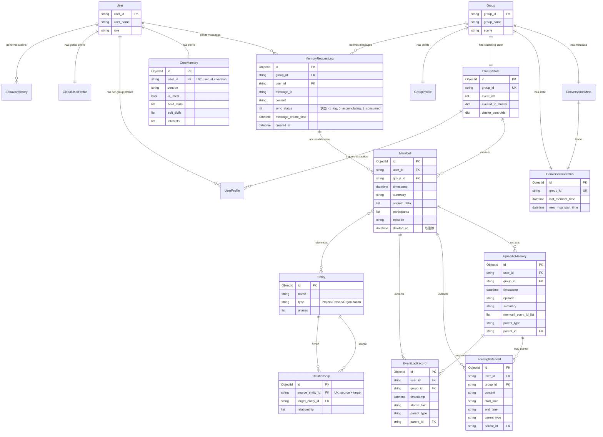
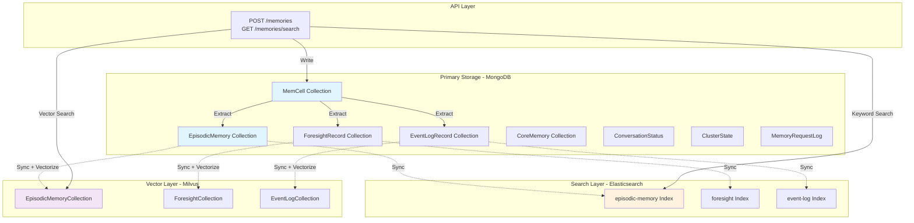
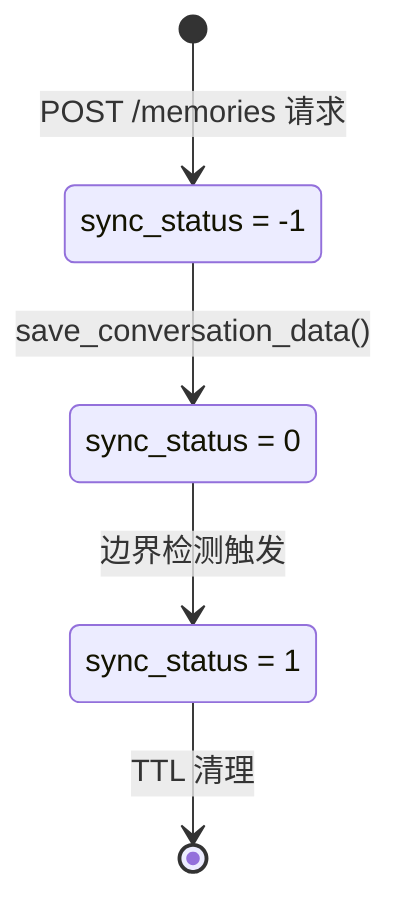
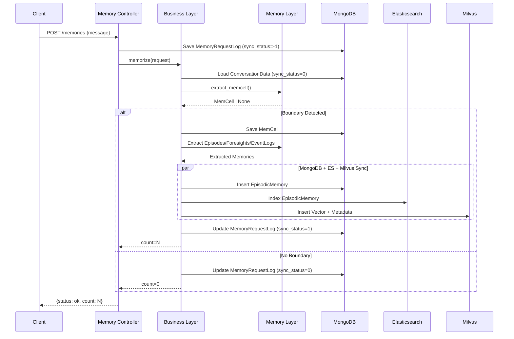
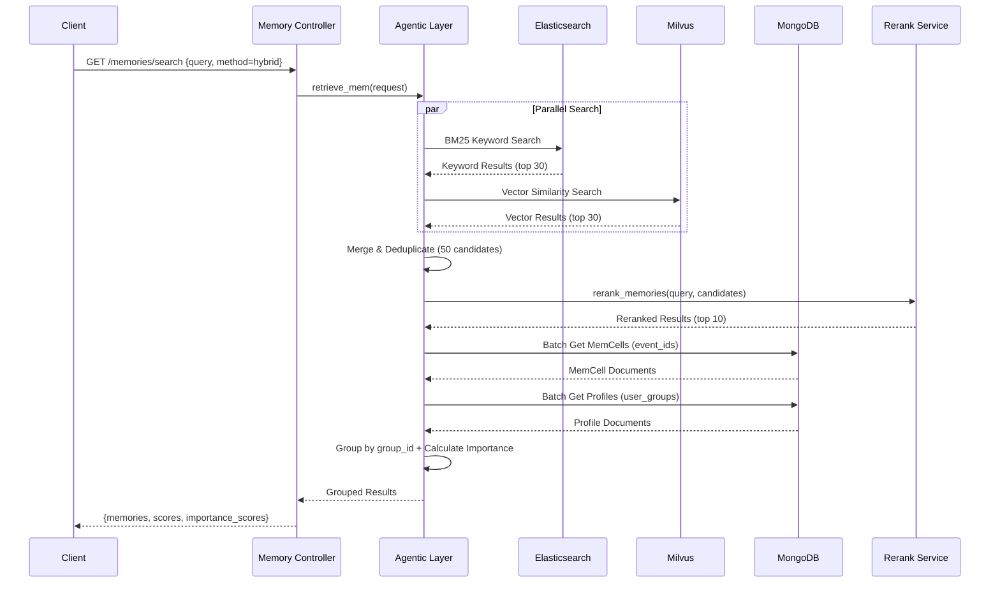
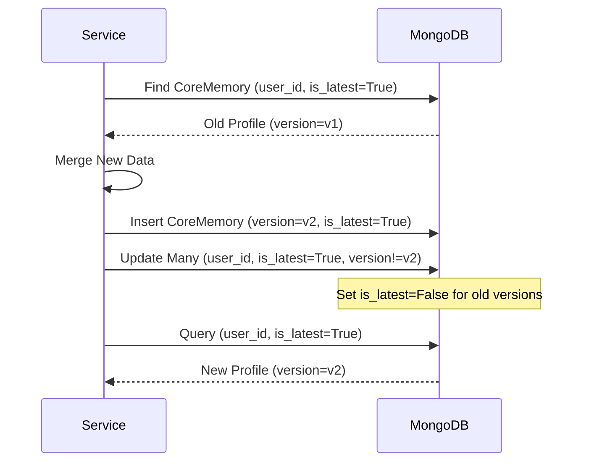
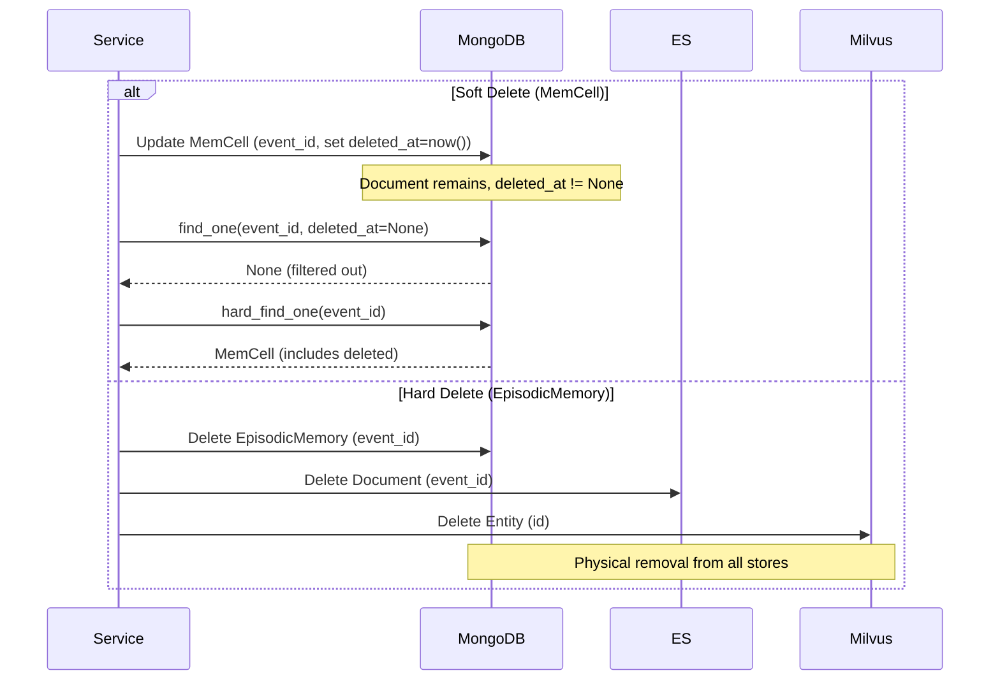

# EverMemOS 数据模型与实体关系图

> 本文档详细描述 EverMemOS 项目的所有数据模型，包括 MongoDB 文档、Elasticsearch 索引、Milvus 向量集合，以及它们之间的关系。

## 目录

- [实体关系图（ER Diagram）](#实体关系图er-diagram)
- [核心记忆模型](#核心记忆模型)
  - [1. MemCell（原始会话片段）](#1-memcell原始会话片段)
  - [2. EpisodicMemory（情节记忆）](#2-episodicmemory情节记忆)
  - [3. ForesightRecord（前瞻记忆）](#3-foresightrecord前瞻记忆)
  - [4. EventLogRecord（事件日志）](#4-eventlogrecord事件日志)
  - [5. CoreMemory（用户画像）](#5-corememory用户画像)
  - [6. ConversationStatus（会话状态）](#6-conversationstatus会话状态)
  - [7. ClusterState（聚类状态）](#7-clusterstate聚类状态)
  - [8. MemoryRequestLog（临时消息缓冲）](#8-memoryrequestlog临时消息缓冲)
- [辅助模型](#辅助模型)
- [索引策略详解](#索引策略详解)
- [数据生命周期](#数据生命周期)
- [设计模式](#设计模式)

---

## 实体关系图（ER Diagram）

### 主要实体关系



### 多数据库架构



---

## 核心记忆模型

### 1. MemCell（原始会话片段）

#### 基本信息

| 属性 | 值 |
|------|-----|
| **文件位置** | `src/infra_layer/adapters/out/persistence/document/memory/memcell.py` |
| **MongoDB 集合** | `memcells` |
| **用途** | 存储边界检测后的原始会话片段，是记忆摄入的基本单元 |

#### 字段定义

| 字段名 | 类型 | 必填 | 默认值 | 说明 |
|--------|------|------|--------|------|
| `id` | ObjectId | 自动 | - | 主键（MongoDB _id） |
| `user_id` | str | 可选 | None | 用户 ID（None 表示群组记忆） |
| `group_id` | str | 可选 | None | 群组 ID（None 表示私聊） |
| `timestamp` | datetime | 必填 | - | 事件发生时间（分片键） |
| `summary` | str | 可选 | None | 记忆单元摘要（可为空表示强制分割） |
| `original_data` | List[RawData] | 可选 | None | 原始对话消息列表 |
| `participants` | List[str] | 可选 | None | 参与者名称列表 |
| `type` | DataTypeEnum | 可选 | None | 场景类型（Conversation） |
| `subject` | str | 可选 | None | 记忆单元主题 |
| `keywords` | List[str] | 可选 | None | 提取的关键词 |
| `linked_entities` | List[str] | 可选 | None | 关联的实体 ID |
| `episode` | str | 可选 | None | 情节记忆内容 |
| `foresight_memories` | List | 可选 | None | 前瞻预测 |
| `event_log` | Dict | 可选 | None | 事件日志原子事实 |
| `extend` | Dict | 可选 | None | 扩展字段 |
| `deleted_at` | datetime | 可选 | None | 软删除时间戳 |
| `created_at` | datetime | 自动 | - | 记录创建时间 |
| `updated_at` | datetime | 自动 | - | 记录更新时间 |

#### 索引策略

```python
# 1. 软删除支持
idx_deleted_at: (deleted_at ASC, sparse)

# 2. 核心查询模式
idx_user_deleted_timestamp: (user_id ASC, deleted_at ASC, timestamp DESC)
idx_group_deleted_timestamp: (group_id ASC, deleted_at ASC, timestamp DESC)

# 3. 类型过滤
idx_user_type_deleted_timestamp: (user_id ASC, type ASC, deleted_at ASC, timestamp DESC)
idx_group_type_deleted_timestamp: (group_id ASC, type ASC, deleted_at ASC, timestamp DESC)

# 4. 参与者查询
idx_participants: (participants ASC, sparse)

# 5. 审计索引
idx_created_at: (created_at DESC)
idx_updated_at: (updated_at DESC)
```

**索引设计理由**：
- ✅ **软删除优化**：`deleted_at` sparse 索引避免索引大量 null 值
- ✅ **时间范围查询**：`timestamp DESC` 支持最近优先排序
- ✅ **复合索引顺序**：`user_id → deleted_at → timestamp` 支持前缀查询
- ✅ **Sparse 索引**：`group_id`, `participants` 仅索引非 null 值

#### 数据生命周期

##### 创建
```python
# 文件: src/infra_layer/adapters/out/persistence/repository/memcell_raw_repository.py
# 方法: append_memcell()

# 触发时机: 边界检测算法判定到达话题边界
memcell = MemCell(
    user_id=user_id,
    group_id=group_id,
    timestamp=datetime.now(),
    original_data=[RawData(...), ...],
    summary="关于项目进度的讨论",
    participants=["Alice", "Bob"],
)
await memcell_repo.append_memcell(memcell)
```

##### 更新
```python
# 更新 episode 字段（提取情节记忆后）
await memcell_repo.update_by_event_id(
    event_id=memcell_id,
    update_data={"episode": "团队讨论了项目 X 的进展..."}
)
```

##### 查询
```python
# 1. 按用户和时间范围查询（自动过滤软删除）
memcells = await memcell_repo.find_many(
    user_id="user_123",
    timestamp_gte=start_time,
    timestamp_lte=end_time,
)

# 2. 按参与者查询
memcells = await memcell_repo.find_by_participants(["Alice"])

# 3. 批量获取（含已删除）
memcells = await memcell_repo.get_by_event_ids(
    event_ids=["id1", "id2", ...],
    include_deleted=True
)
```

##### 删除
```python
# 软删除（推荐）
await memcell_repo.delete(event_id=memcell_id)
# 设置 deleted_at = datetime.now()

# 硬删除（物理删除）
await memcell_repo.hard_delete(event_id=memcell_id)
# 从数据库中永久删除
```

#### 关联关系

- **父级**: MemoryRequestLog（多条消息累积形成）
- **子级**:
  - EpisodicMemory（通过 `parent_type="memcell"`, `parent_id`）
  - ForesightRecord（通过 `parent_type="memcell"`, `parent_id`）
  - EventLogRecord（通过 `parent_type="memcell"`, `parent_id`）
- **引用**: Entity（通过 `linked_entities`）

---

### 2. EpisodicMemory（情节记忆）

#### 基本信息

| 属性 | 值 |
|------|-----|
| **文件位置** | `src/infra_layer/adapters/out/persistence/document/memory/episodic_memory.py` |
| **MongoDB 集合** | `episodic_memories` |
| **Elasticsearch 索引** | `episodic-memory` |
| **Milvus 集合** | `EpisodicMemoryCollection` |
| **用途** | 存储事件的叙事性记忆，支持个人和群组记忆 |

#### 字段定义

| 字段名 | 类型 | 必填 | 默认值 | 说明 |
|--------|------|------|--------|------|
| `id` | ObjectId | 自动 | - | 主键 |
| `user_id` | str | 可选 | None | 用户 ID（None = 群组记忆） |
| `user_name` | str | 可选 | None | 用户名 |
| `group_id` | str | 可选 | None | 群组 ID |
| `group_name` | str | 可选 | None | 群组名 |
| `timestamp` | datetime | 必填 | - | 事件发生时间 |
| `participants` | List[str] | 可选 | None | 参与者名称 |
| `summary` | str | 必填 | - | 记忆单元摘要（最小长度 1） |
| `subject` | str | 可选 | None | 记忆主题/标题 |
| `episode` | str | 必填 | - | 情节记忆内容（最小长度 1） |
| `type` | str | 可选 | None | 情节类型（如 "Conversation"） |
| `keywords` | List[str] | 可选 | None | 关键词 |
| `linked_entities` | List[str] | 可选 | None | 实体 ID |
| `memcell_event_id_list` | List[str] | 可选 | None | 源 MemCell ID 列表 |
| `parent_type` | str | 可选 | None | 父记忆类型（如 "memcell"） |
| `parent_id` | str | 可选 | None | 父记忆 ID |
| `vector` | List[float] | 可选 | None | 文本嵌入向量 |
| `vector_model` | str | 可选 | None | 嵌入模型名称 |
| `extend` | Dict | 可选 | None | 扩展字段 |
| `created_at` | datetime | 自动 | - | 创建时间 |
| `updated_at` | datetime | 自动 | - | 更新时间 |

#### MongoDB 索引

```python
idx_user_id: (user_id ASC)
idx_parent_id: (parent_id ASC)
idx_user_timestamp: (user_id ASC, timestamp DESC)
idx_group_timestamp: (group_id ASC, timestamp DESC, sparse)
idx_group_user_timestamp: (group_id ASC, user_id ASC, timestamp DESC, sparse)
idx_keywords: (keywords ASC, sparse)
idx_linked_entities: (linked_entities ASC, sparse)
idx_created_at: (created_at DESC)
idx_updated_at: (updated_at DESC)
```

#### Elasticsearch 映射

```python
# 主 BM25 搜索字段
search_content: Text (多值, standard analyzer)
  - .original: Keyword (lowercase analyzer, 精确匹配)

# 内容字段
title: Text (whitespace analyzer, keyword 子字段)
episode: Text (whitespace analyzer, 必填)
summary: Text (whitespace analyzer)

# 过滤字段
event_id: Keyword (必填, 来自 MongoDB _id)
user_id: Keyword
group_id: Keyword
timestamp: Date (必填)
type: Keyword
keywords: Keyword (多值)
linked_entities: Keyword (多值)
participants: Keyword (多值)
```

**分析器配置**：
```python
# whitespace_lowercase_trim_stop_analyzer
# 用于预分词内容（已经过 jieba 分词）
{
    "tokenizer": "whitespace",
    "filter": ["lowercase", "trim", "stop"]
}

# standard analyzer
# 用于 search_content 多值字段（原始文本）
{
    "tokenizer": "standard",
    "filter": ["lowercase"]
}

# lower_keyword_analyzer
# 用于精确匹配子字段
{
    "tokenizer": "keyword",
    "filter": ["lowercase"]
}
```

#### Milvus 集合模式

```python
# 向量字段
vector: FLOAT_VECTOR(1024)
  - 索引类型: HNSW
  - 参数: M=16, efConstruction=200
  - 距离度量: COSINE

# 标量字段（AUTOINDEX）
id: VARCHAR(100) - 主键
user_id: VARCHAR(100)
group_id: VARCHAR(100)
event_type: VARCHAR(50)
timestamp: INT64
parent_id: VARCHAR(100)
participants: ARRAY[VARCHAR(100)] - 最多 100 个元素

# 内容字段
episode: VARCHAR(10000)
search_content: VARCHAR(5000)

# 元数据
metadata: VARCHAR(50000) - JSON blob

# 集合配置
enable_dynamic_field: True
```

**HNSW 索引参数说明**：
- `M=16`：每个节点的最大连接数（越大召回率越高，但内存占用越大）
- `efConstruction=200`：构建索引时的搜索深度（越大索引质量越高，但构建越慢）
- `ef=64`（搜索时）：搜索时的候选集大小（运行时可调整）

#### 数据生命周期

##### 创建
```python
# 文件: src/biz_layer/mem_memorize.py
# 函数: save_memory_docs()

# 1. 保存到 MongoDB
episode_doc = EpisodicMemory(
    user_id="user_123",
    group_id="group_456",
    timestamp=datetime.now(),
    episode="团队讨论了项目 X 的进展，Alice 提到...",
    summary="项目进度讨论",
    memcell_event_id_list=["memcell_id_1"],
    parent_type="memcell",
    parent_id="memcell_id_1",
)
saved_doc = await episodic_memory_repo.append(episode_doc)

# 2. 同步到 Elasticsearch
es_doc = EpisodicMemoryConverter.from_mongo(saved_doc)
await episodic_memory_es_repo.create(es_doc)

# 3. 同步到 Milvus（含向量化）
milvus_entity = EpisodicMemoryMilvusConverter.from_mongo(saved_doc)
embedding = await vectorize_service.get_embedding(milvus_entity.episode)
milvus_entity.vector = embedding
await episodic_memory_milvus_repo.insert(milvus_entity)
```

##### 查询

**MongoDB 查询**：
```python
# 按用户和时间范围
episodes = await episodic_memory_repo.find_many(
    user_id="user_123",
    timestamp_gte=start_time,
    timestamp_lte=end_time,
)
```

**Elasticsearch BM25 搜索**：
```python
# 文件: src/agentic_layer/memory_manager.py
# 方法: get_keyword_search_results()

# 1. 中文分词
query_tokens = jieba.cut_for_search("项目进度如何")
# → ["项目", "进度", "如何"]

# 2. 过滤停用词
query_tokens = [t for t in query_tokens if t not in STOPWORDS]

# 3. Elasticsearch 查询
search_results = await episodic_memory_es_repo.multi_search(
    query=query_tokens,
    user_id="user_123",
    date_range={"gte": start_time, "lte": end_time},
    size=10,
)
```

**Milvus 向量搜索**：
```python
# 文件: src/agentic_layer/memory_manager.py
# 方法: get_vector_search_results()

# 1. 向量化查询
query_vector = await vectorize_service.get_embedding("项目进度如何")

# 2. 构建过滤表达式
expr = f'user_id == "user_123" && timestamp >= {int(start_time.timestamp())}'

# 3. 向量搜索
search_results = await episodic_memory_milvus_repo.vector_search(
    query_vector=query_vector,
    limit=10,
    expr=expr,
    radius=0.5,  # COSINE 相似度阈值
)
```

##### 删除
```python
# 硬删除（无软删除支持）
await episodic_memory_repo.delete_many(
    filter={"user_id": "user_123", "timestamp": {"$lt": cutoff_date}}
)

# 同时删除 ES 和 Milvus 记录
await episodic_memory_es_repo.delete_by_id(event_id)
await episodic_memory_milvus_repo.delete_by_id(event_id)
```

---

### 3. ForesightRecord（前瞻记忆）

#### 基本信息

| 属性 | 值 |
|------|-----|
| **文件位置** | `src/infra_layer/adapters/out/persistence/document/memory/foresight_record.py` |
| **MongoDB 集合** | `foresight_records` |
| **Elasticsearch 索引** | `foresight` |
| **Milvus 集合** | `ForesightCollection` |
| **用途** | 存储从对话中提取的前瞻性预测和计划 |

#### 字段定义

| 字段名 | 类型 | 必填 | 默认值 | 说明 |
|--------|------|------|--------|------|
| `id` | ObjectId | 自动 | - | 主键 |
| `user_id` | str | 可选 | None | 用户 ID（None = 群组前瞻） |
| `user_name` | str | 可选 | None | 用户名 |
| `group_id` | str | 可选 | None | 群组 ID |
| `group_name` | str | 可选 | None | 群组名 |
| `content` | str | 必填 | - | 前瞻内容（最小长度 1） |
| `parent_type` | str | 必填 | - | 父类型（memcell/episode） |
| `parent_id` | str | 必填 | - | 父记忆 ID |
| `start_time` | str | 可选 | None | 开始日期（YYYY-MM-DD） |
| `end_time` | str | 可选 | None | 结束日期（YYYY-MM-DD） |
| `duration_days` | int | 可选 | None | 持续天数 |
| `participants` | List[str] | 可选 | None | 相关参与者 |
| `vector` | List[float] | 可选 | None | 内容嵌入 |
| `vector_model` | str | 可选 | None | 嵌入模型 |
| `evidence` | str | 可选 | None | 支持证据 |
| `extend` | Dict | 可选 | None | 扩展字段 |
| `created_at` | datetime | 自动 | - | 创建时间 |
| `updated_at` | datetime | 自动 | - | 更新时间 |

#### MongoDB 索引

```python
idx_user_id: (user_id ASC)
idx_group_id: (group_id ASC, sparse)
idx_parent_id: (parent_id ASC)

# 时间范围查询优化
idx_time_range: (start_time ASC, end_time ASC, sparse)
idx_user_time_range: (user_id ASC, start_time ASC, end_time ASC, sparse)
idx_group_time_range: (group_id ASC, start_time ASC, end_time ASC, sparse)
idx_group_user_time_range: (group_id ASC, user_id ASC, start_time ASC, end_time ASC, sparse)

idx_created_at: (created_at DESC)
idx_updated_at: (updated_at DESC)
```

**时间范围查询示例**：
```python
# 查询当前有效的前瞻记忆
current_date = "2024-02-08"
foresights = await foresight_repo.find_many(
    user_id="user_123",
    start_time_lte=current_date,  # 已经开始
    end_time_gte=current_date,    # 还未结束
)
```

#### Projection 模型

```python
# 文件: src/infra_layer/adapters/out/persistence/document/memory/foresight_record.py
# 类: ForesightRecordProjection

# 用途: 排除 vector 字段以提高查询效率
class ForesightRecordProjection(BaseModel):
    # 包含除 vector 外的所有字段
    id: ObjectId
    user_id: Optional[str]
    content: str
    # ...（不包含 vector）
```

**使用方式**：
```python
# 查询时排除向量字段
foresights = await foresight_repo.find_many(
    projection_model=ForesightRecordProjection
)
```

---

### 4. EventLogRecord（事件日志）

#### 基本信息

| 属性 | 值 |
|------|-----|
| **文件位置** | `src/infra_layer/adapters/out/persistence/document/memory/event_log_record.py` |
| **MongoDB 集合** | `event_log_records` |
| **Elasticsearch 索引** | `event-log` |
| **Milvus 集合** | `EventLogCollection` |
| **用途** | 存储从情节记忆中分解的原子事实，便于细粒度检索 |

#### 字段定义

| 字段名 | 类型 | 必填 | 默认值 | 说明 |
|--------|------|------|--------|------|
| `id` | ObjectId | 自动 | - | 主键 |
| `user_id` | str | 可选 | None | 用户 ID |
| `user_name` | str | 可选 | None | 用户名 |
| `group_id` | str | 可选 | None | 群组 ID |
| `group_name` | str | 可选 | None | 群组名 |
| `atomic_fact` | str | 必填 | - | 原子事实内容（单句） |
| `parent_type` | str | 必填 | - | 父类型（memcell/episode） |
| `parent_id` | str | 必填 | - | 父 ID |
| `timestamp` | datetime | 必填 | - | 事件时间 |
| `participants` | List[str] | 可选 | None | 参与者 |
| `vector` | List[float] | 可选 | None | 事实嵌入 |
| `vector_model` | str | 可选 | None | 模型名 |
| `event_type` | str | 可选 | None | 事件类型 |
| `extend` | Dict | 可选 | None | 扩展字段 |
| `created_at` | datetime | 自动 | - | 创建时间 |
| `updated_at` | datetime | 自动 | - | 更新时间 |

#### MongoDB 索引

```python
idx_user_id: (user_id ASC)
idx_group_id: (group_id ASC, sparse)
idx_timestamp: (timestamp DESC)
idx_parent_id: (parent_id ASC)
idx_user_timestamp: (user_id ASC, timestamp DESC)
idx_group_timestamp: (group_id ASC, timestamp DESC, sparse)
idx_group_user_timestamp: (group_id ASC, user_id ASC, timestamp DESC, sparse)
idx_created_at: (created_at DESC)
idx_updated_at: (updated_at DESC)
```

#### 原子事实示例

```python
# 输入 Episode:
episode = "团队讨论了项目 X 的进展。Alice 提到后端开发已完成 80%。Bob 负责前端，预计下周完成。"

# 提取的原子事实 (Atomic Facts):
[
    "团队讨论了项目 X 的进展",
    "Alice 提到后端开发已完成 80%",
    "Bob 负责前端",
    "前端预计下周完成"
]
```

---

### 5. CoreMemory（用户画像）

#### 基本信息

| 属性 | 值 |
|------|-----|
| **文件位置** | `src/infra_layer/adapters/out/persistence/document/memory/core_memory.py` |
| **MongoDB 集合** | `core_memories` |
| **用途** | 统一存储用户的基本信息、画像和偏好，支持版本控制 |

#### 字段定义（分类）

##### 基础信息
| 字段名 | 类型 | 说明 |
|--------|------|------|
| `user_id` | str | 用户 ID（必填，UK: user_id + version） |
| `version` | str | 版本号 |
| `is_latest` | bool | 是否最新版本（默认 True） |
| `user_name` | str | 用户名 |
| `gender` | str | 性别 |
| `age` | int | 年龄 |
| `position` | str | 职位 |
| `department` | str | 部门 |
| `base_location` | str | 所在地 |
| `hiredate` | str | 入职日期 |

##### 组织关系
| 字段名 | 类型 | 说明 |
|--------|------|------|
| `supervisor_user_id` | str | 上级 ID |
| `team_members` | List[str] | 团队成员 ID 列表 |
| `okr` | List[Dict] | OKR 目标 |

##### 技能画像（带证据）
| 字段名 | 类型 | 格式 |
|--------|------|------|
| `hard_skills` | List[Dict] | `{"value": "Python", "level": "Advanced", "evidences": ["2024-01-01&#124;conv_123"]}` |
| `soft_skills` | List[Dict] | `{"value": "沟通能力", "evidences": [...]}` |

##### 心理画像（带证据）
| 字段名 | 类型 | 说明 |
|--------|------|------|
| `motivation_system` | List[Dict] | 动机系统 |
| `fear_system` | List[Dict] | 恐惧系统 |
| `value_system` | List[Dict] | 价值观系统 |
| `personality` | List[Dict] | 性格特征 |

##### 行为偏好（带证据）
| 字段名 | 类型 | 说明 |
|--------|------|------|
| `humor_use` | List[Dict] | 幽默风格 |
| `colloquialism` | List[Dict] | 口头禅 |
| `working_habit_preference` | List[Dict] | 工作习惯偏好 |
| `way_of_decision_making` | List[Dict] | 决策方式 |
| `tendency` | List[Dict] | 偏好倾向 |

##### 其他
| 字段名 | 类型 | 说明 |
|--------|------|------|
| `interests` | List[Dict] | 兴趣爱好 |
| `projects_participated` | List[Dict] | 参与项目 |
| `user_goal` | List[Dict] | 个人目标 |
| `work_responsibility` | List[Dict] | 工作职责 |
| `group_importance_evidence` | Dict | 群组重要性证据 |
| `output_reasoning` | str | 推理输出 |
| `extend` | Dict | 扩展字段 |

#### 证据格式

```python
# 技能格式（兼容新旧格式）
# 新格式
{
    "value": "Python",
    "level": "Advanced",  # 可选
    "evidences": [
        "2024-01-01|conv_123",  # 日期|会话ID
        "2024-01-15|conv_456"
    ]
}

# 旧格式（向后兼容）
{
    "skill": "Python",
    "level": "Advanced",
    "evidences": ["2024-01-01|conv_123"]
}

# 其他属性格式
{
    "value": "注重细节",
    "evidences": ["2024-01-10|conv_789"]
}
```

#### MongoDB 索引

```python
# 唯一约束：同一用户同一版本只能有一条记录
idx_user_id_version_unique: (user_id ASC, version ASC) UNIQUE

# 查询最新版本
idx_user_id_is_latest: (user_id ASC, is_latest ASC)

# 审计索引
idx_created_at: (created_at DESC)
idx_updated_at: (updated_at DESC)
```

#### 版本控制机制

```python
# 创建新版本
new_version = CoreMemory(
    user_id="user_123",
    version="v2",
    is_latest=True,
    hard_skills=[{"value": "Python", "level": "Expert", ...}],
    # ... 其他字段
)
await core_memory_repo.insert(new_version)

# 将旧版本标记为非最新
await core_memory_repo.update_many(
    filter={
        "user_id": "user_123",
        "is_latest": True,
        "version": {"$ne": "v2"}
    },
    update={"$set": {"is_latest": False}}
)

# 查询最新版本
latest_profile = await core_memory_repo.find_one(
    user_id="user_123",
    is_latest=True
)
```

---

### 6. ConversationStatus（会话状态）

#### 基本信息

| 属性 | 值 |
|------|-----|
| **文件位置** | `src/infra_layer/adapters/out/persistence/document/memory/conversation_status.py` |
| **MongoDB 集合** | `conversation_status` |
| **用途** | 追踪会话处理状态（消息读取位置、最后 MemCell 时间） |

#### 字段定义

| 字段名 | 类型 | 必填 | 默认值 | 说明 |
|--------|------|------|--------|------|
| `id` | ObjectId | 自动 | - | 主键（conversation_id） |
| `group_id` | str | 必填 | - | 群组 ID（唯一） |
| `old_msg_start_time` | datetime | 可选 | None | 历史消息窗口起始时间 |
| `new_msg_start_time` | datetime | 可选 | None | 新消息累积起始时间 |
| `last_memcell_time` | datetime | 可选 | None | 最后一次 MemCell 时间戳 |
| `created_at` | datetime | 自动 | - | 创建时间 |
| `updated_at` | datetime | 自动 | - | 更新时间 |

#### MongoDB 索引

```python
idx_group_id: (group_id ASC) UNIQUE
idx_created_at: (created_at DESC)
idx_updated_at: (updated_at DESC)
```

#### 状态追踪流程

```
[第一条消息] → 创建 ConversationStatus
    last_memcell_time = None
    new_msg_start_time = message_time

[累积消息] → 不更新 ConversationStatus

[边界检测触发] → 更新 ConversationStatus
    last_memcell_time = memcell_time
    new_msg_start_time = next_message_time

[下一轮累积] → 使用 last_memcell_time 加载历史
```

---

### 7. ClusterState（聚类状态）

#### 基本信息

| 属性 | 值 |
|------|-----|
| **文件位置** | `src/infra_layer/adapters/out/persistence/document/memory/cluster_state.py` |
| **MongoDB 集合** | `cluster_states` |
| **用途** | 维护每个群组的增量聚类状态（事件到聚类的映射、质心） |

#### 字段定义

| 字段名 | 类型 | 默认值 | 说明 |
|--------|------|--------|------|
| `id` | ObjectId | - | 主键 |
| `group_id` | str | - | 群组 ID（主标识符） |
| `event_ids` | List[str] | [] | 所有事件 ID 列表 |
| `timestamps` | List[float] | [] | 时间戳列表 |
| `cluster_ids` | List[str] | [] | 聚类 ID 列表 |
| `eventid_to_cluster` | Dict[str, str] | {} | 事件→聚类映射 |
| `next_cluster_idx` | int | 0 | 下一个聚类索引 |
| `cluster_centroids` | Dict[str, List[float]] | {} | 聚类质心 `{cluster_id: vector}` |
| `cluster_counts` | Dict[str, int] | {} | 聚类大小 |
| `cluster_last_ts` | Dict[str, float] | {} | 最后时间戳 |
| `created_at` | datetime | - | 创建时间 |
| `updated_at` | datetime | - | 更新时间 |

#### 聚类流程

```python
# 文件: src/memory_layer/cluster_manager/cluster_manager.py
# 方法: cluster_memcell()

# 1. 加载聚类状态
cluster_state = await cluster_state_repo.get_by_group_id(group_id)

# 2. 向量化新 MemCell
embedding = await vectorize_service.get_embedding(memcell.summary)

# 3. 计算与现有聚类质心的相似度
similarities = [
    cosine_similarity(embedding, centroid)
    for centroid in cluster_state.cluster_centroids.values()
]

# 4. 分配聚类
if max(similarities) > SIMILARITY_THRESHOLD:
    cluster_id = existing_cluster_id
else:
    cluster_id = f"cluster_{cluster_state.next_cluster_idx}"
    cluster_state.next_cluster_idx += 1

# 5. 更新状态
cluster_state.eventid_to_cluster[memcell.event_id] = cluster_id
cluster_state.cluster_centroids[cluster_id] = updated_centroid
cluster_state.cluster_counts[cluster_id] += 1

# 6. 保存状态
await cluster_state_repo.save(cluster_state)

# 7. 如果聚类达到阈值，触发 Profile 提取
if cluster_state.cluster_counts[cluster_id] >= PROFILE_THRESHOLD:
    await extract_profile_for_cluster(cluster_id)
```

---

### 8. MemoryRequestLog（临时消息缓冲）

#### 基本信息

| 属性 | 值 |
|------|-----|
| **文件位置** | `src/infra_layer/adapters/out/persistence/document/request/memory_request_log.py` |
| **MongoDB 集合** | `memory_request_logs` |
| **用途** | 边界检测前的临时消息存储，取代 Redis 的 ConversationData |

#### 字段定义

##### 核心字段
| 字段名 | 类型 | 必填 | 说明 |
|--------|------|------|------|
| `id` | ObjectId | 自动 | 主键 |
| `group_id` | str | 必填 | 群组 ID |
| `request_id` | str | 必填 | 请求 ID |
| `user_id` | str | 可选 | 用户 ID |

##### 消息字段
| 字段名 | 类型 | 说明 |
|--------|------|------|
| `message_id` | str | 消息 ID |
| `message_create_time` | str | 消息时间戳（ISO 8601） |
| `sender` | str | 发送者 ID |
| `sender_name` | str | 发送者名称 |
| `role` | str | 角色（'user' 或 'assistant'） |
| `content` | str | 消息内容 |
| `group_name` | str | 群组名称 |
| `refer_list` | List[str] | 引用的消息 ID |

##### 元数据字段
| 字段名 | 类型 | 说明 |
|--------|------|------|
| `raw_input` | Dict | 解析后的 JSON 请求体 |
| `raw_input_str` | str | 原始输入字符串 |
| `version` | str | 代码版本 |
| `endpoint_name` | str | 端点名称 |
| `method` | str | HTTP 方法 |
| `url` | str | 请求 URL |
| `event_id` | str | 事件 ID |

##### 同步状态
| 字段名 | 类型 | 默认值 | 说明 |
|--------|------|--------|------|
| `sync_status` | int | -1 | **-1**=日志记录, **0**=累积中, **1**=已使用 |
| `created_at` | datetime | 自动 | 创建时间 |
| `updated_at` | datetime | 自动 | 更新时间 |

#### sync_status 状态流转



#### MongoDB 索引

```python
# 复合索引
(group_id ASC, created_at DESC)
(group_id ASC, message_create_time DESC)
(group_id ASC, sync_status ASC)
(group_id ASC, user_id ASC, sync_status ASC)

# 单字段索引
(request_id ASC)
(user_id ASC)
(created_at DESC)
(event_id ASC)
(message_id ASC)
```

#### 数据生命周期

```python
# 1. 创建：每次 POST /memories 请求
request_log = MemoryRequestLog(
    group_id="group_123",
    request_id=str(uuid.uuid4()),
    user_id="user_456",
    message_id="msg_789",
    message_create_time="2024-02-08T10:00:00Z",
    sender="user_456",
    content="项目进度如何？",
    sync_status=-1,  # 初始状态：日志记录
)
await memory_request_log_repo.insert(request_log)

# 2. 更新：进入累积窗口
await memory_request_log_repo.update_many(
    filter={"group_id": "group_123", "sync_status": -1},
    update={"$set": {"sync_status": 0}}  # 累积中
)

# 3. 查询：获取待处理消息
pending_messages = await memory_request_log_repo.find_many(
    group_id="group_123",
    sync_status__in=[-1, 0],  # 日志记录 + 累积中
    sort=[("message_create_time", 1)]
)

# 4. 标记已使用：边界检测后
await memory_request_log_repo.update_many(
    filter={"group_id": "group_123", "sync_status": 0},
    update={"$set": {"sync_status": 1}}  # 已使用
)

# 5. 删除：TTL 清理（定期任务）
cutoff_time = datetime.now() - timedelta(days=7)
await memory_request_log_repo.delete_many(
    filter={"sync_status": 1, "created_at": {"$lt": cutoff_time}}
)
```

---

## 辅助模型

### ConversationMeta（会话元数据）

**文件**: `src/infra_layer/adapters/out/persistence/document/memory/conversation_meta.py`

**核心字段**:
- `scene`, `scene_desc`: 场景标识和描述
- `group_id`: 群组 ID（唯一，None 表示默认）
- `user_details`: `Dict[str, UserDetailModel]` - 参与者详情
- `tags`: 分类标签列表
- `conversation_created_at`: ISO 时间戳
- `default_timezone`: 时区键

**UserDetailModel**:
```python
user_id: str
user_name: Optional[str]
role: Optional[str]  # 'user' | 'assistant'
```

---

### Entity（实体）

**文件**: `src/infra_layer/adapters/out/persistence/document/memory/entity.py`

**字段**:
- `name`: 实体名称
- `type`: 类型（Project, Person, Organization）
- `aliases`: 别名列表
- `extend`: 扩展字段

**索引**: `idx_aliases: (aliases ASC, sparse)`

---

### Relationship（关系）

**文件**: `src/infra_layer/adapters/out/persistence/document/memory/relationship.py`

**字段**:
- `source_entity_id`: 源实体 ID
- `target_entity_id`: 目标实体 ID
- `relationship`: `List[Dict]` - 关系详情（type/content/detail）

**索引**:
```python
idx_source_target_unique: (source_entity_id ASC, target_entity_id ASC) UNIQUE
idx_target_source_unique: (target_entity_id ASC, source_entity_id ASC) UNIQUE
```

---

### UserProfile（群组用户画像）

**文件**: `src/infra_layer/adapters/out/persistence/document/memory/user_profile.py`

**核心字段**:
- `user_id`, `group_id`: 复合主键
- `profile_data`: `Dict[str, Any]` - 画像 JSON
- `scenario`: "group_chat" 或 "assistant"
- `confidence`: 画像置信度（0-1）
- `cluster_ids`: 关联的聚类 ID
- `version`: 画像版本

---

### GroupProfile（群组画像）

**文件**: `src/infra_layer/adapters/out/persistence/document/memory/group_profile.py`

**核心字段**:
- `group_id`: 群组标识
- `version`, `is_latest`: 版本控制
- `topics`: `List[TopicInfo]` - 近期话题
- `roles`: `Dict[str, List[RoleAssignment]]` - 角色分配
- `subject`: 群组长期主题
- `summary`: 近期话题摘要

**TopicInfo 结构**:
```python
name: str              # 话题标签
summary: str           # 一句话总结
status: str            # exploring/disagreement/consensus/implemented
last_active_at: datetime
id: str (auto)
evidences: List[str]   # memcell_ids
confidence: str        # strong/weak
```

**RoleAssignment 结构**:
```python
user_id: str
user_name: str
confidence: str        # strong/weak
evidences: List[str]
```

---

### BehaviorHistory（行为历史）

**文件**: `src/infra_layer/adapters/out/persistence/document/memory/behavior_history.py`

**核心字段**:
- `user_id`, `timestamp`: 复合键
- `behavior_type`: `List[str]` - 行为类型
  - chat（聊天）
  - follow-up（跟进）
  - Smart-Reply（智能回复）
  - Vote（投票）
  - file（文件操作）
  - Email（邮件）
  - link-doc（关联文档）
- `event_id`: 关联的记忆 ID
- `meta`: 行为元数据

**索引**:
```python
idx_user_type_timestamp: (user_id ASC, behavior_type ASC, timestamp ASC)
idx_event_id: (event_id ASC)
```

---

## 索引策略详解

### MongoDB 索引设计原则

#### 1. 复合索引顺序

**规则**: 等值查询字段 → 范围查询字段 → 排序字段

**示例**:
```python
# ✅ 正确：user_id (等值) → timestamp (范围 + 排序)
idx_user_timestamp: (user_id ASC, timestamp DESC)

# ❌ 错误：timestamp 在前会导致 user_id 过滤失效
# 错误索引: (timestamp DESC, user_id ASC)
```

**查询优化**:
```python
# 查询 1: 能够使用 idx_user_timestamp
find({"user_id": "user_123", "timestamp": {"$gte": start_time}})

# 查询 2: 能够使用 idx_user_timestamp（前缀匹配）
find({"user_id": "user_123"})

# 查询 3: 不能使用 idx_user_timestamp（缺少前缀）
find({"timestamp": {"$gte": start_time}})  # 需要单独的 idx_timestamp
```

#### 2. Sparse 索引

**用途**: 仅索引包含该字段的文档

**示例**:
```python
# group_id 是可选字段，大量文档为 None
idx_group_id: (group_id ASC, sparse=True)

# 优势：
# - 减少索引大小（不索引 group_id=None 的文档）
# - 提高写入性能
# - 适用于可选字段查询
```

#### 3. Unique 索引

**用途**: 强制唯一性约束

**示例**:
```python
# CoreMemory: 同一用户同一版本只能有一条记录
idx_user_id_version_unique: (user_id ASC, version ASC, unique=True)

# ConversationStatus: 每个群组只有一条状态记录
idx_group_id: (group_id ASC, unique=True)

# Relationship: 防止重复关系
idx_source_target_unique: (source_entity_id ASC, target_entity_id ASC, unique=True)
```

#### 4. 软删除优化

**模式**: 包含 `deleted_at` 字段的复合索引

**示例**:
```python
# MemCell 软删除索引
idx_user_deleted_timestamp: (user_id ASC, deleted_at ASC, timestamp DESC)

# 查询时自动过滤软删除记录
find({"user_id": "user_123", "deleted_at": None})
# 使用索引：user_id → deleted_at=None → timestamp 排序
```

---

### Elasticsearch 索引策略

#### 1. 分析器选择

**whitespace_lowercase_trim_stop_analyzer** (预分词内容):
```json
{
    "tokenizer": "whitespace",
    "filter": ["lowercase", "trim", "stop"]
}
```

**用途**:
- `title`, `episode`, `summary` 字段
- 内容已经过 jieba 分词，空格分隔
- 避免二次分词破坏中文语义

**standard analyzer** (原始文本):
```json
{
    "tokenizer": "standard",
    "filter": ["lowercase"]
}
```

**用途**:
- `search_content` 多值字段
- 支持原始文本的标准分词

#### 2. 多值字段 + 子字段

**模式**:
```json
{
    "search_content": {
        "type": "text",
        "analyzer": "standard",
        "fields": {
            "original": {
                "type": "keyword",
                "normalizer": "lowercase"
            }
        }
    }
}
```

**用途**:
- `search_content`: BM25 全文搜索
- `search_content.original`: 精确匹配（小写规范化）

#### 3. Keyword 类型优化

**使用场景**: 过滤、聚合、排序

**示例**:
```json
{
    "user_id": {"type": "keyword"},
    "group_id": {"type": "keyword"},
    "keywords": {"type": "keyword"}  # 数组
}
```

**优势**:
- 不分词，整体匹配
- 支持精确过滤和聚合
- 内存占用小

---

### Milvus 索引策略

#### 1. HNSW 索引参数

**索引类型**: HNSW (Hierarchical Navigable Small World)

**参数**:
```python
{
    "M": 16,                # 每个节点的最大连接数
    "efConstruction": 200   # 构建时的搜索深度
}
```

**M 参数影响**:
- M=8: 更快的构建速度，较低召回率
- M=16: 平衡（推荐）
- M=32: 更高召回率，但内存占用翻倍

**efConstruction 参数影响**:
- ef=100: 快速构建，质量一般
- ef=200: 平衡（推荐）
- ef=400: 高质量索引，但构建慢

#### 2. 搜索时参数

**ef 参数**（运行时可调整）:
```python
search_params = {
    "metric_type": "COSINE",
    "params": {"ef": 64}  # 搜索时的候选集大小
}
```

**ef 影响**:
- ef=10: 极快，召回率低
- ef=64: 平衡（推荐）
- ef=128: 高召回率，速度较慢

#### 3. AUTOINDEX 标量索引

**自动索引字段**:
```python
user_id, group_id, event_type, timestamp, parent_id
```

**特点**:
- 自动选择最优索引类型（B-tree/Hash）
- 支持等值查询和范围查询
- 支持表达式过滤（`expr="user_id == 'user_123'"`）

#### 4. 距离度量选择

**COSINE** (余弦相似度):
- 范围: [-1, 1]（归一化后 [0, 1]）
- 忽略向量长度，只关注方向
- 适合文本嵌入（长度差异大）

**L2** (欧氏距离):
- 范围: [0, ∞)
- 考虑向量长度
- 适合图像嵌入

**IP** (内积):
- 范围: [-∞, +∞]
- 向量长度归一化后等价于 COSINE
- 计算最快

---

## 数据生命周期

### 写入流程（端到端）



### 查询流程（混合检索）



### 更新流程（版本控制）



### 删除流程（软删除）



---

## 设计模式

### 1. 多租户模式

**实现方式**: 所有模型包含 `user_id` 和 `group_id` 字段

**查询过滤**:
```python
# Repository 层自动添加租户过滤
async def find_many(self, user_id: str, **kwargs):
    filter = {"user_id": user_id, **kwargs}
    return await self.collection.find(filter).to_list()
```

**Elasticsearch**:
```python
{
    "query": {
        "bool": {
            "must": [...],
            "filter": [
                {"term": {"user_id": "user_123"}},
                {"term": {"group_id": "group_456"}}
            ]
        }
    }
}
```

**Milvus**:
```python
expr = 'user_id == "user_123" && group_id == "group_456"'
results = await milvus_repo.vector_search(
    query_vector=vector,
    expr=expr
)
```

---

### 2. 版本控制模式

**适用模型**: CoreMemory, GroupProfile

**实现**:
```python
# 字段
user_id: str         # 实体标识
version: str         # 版本号（如 "v1", "v2"）
is_latest: bool      # 最新版本标志

# 唯一索引
idx_user_id_version_unique: (user_id, version) UNIQUE
idx_user_id_is_latest: (user_id, is_latest)
```

**优势**:
- ✅ 保留历史版本
- ✅ 快速查询最新版本
- ✅ 支持版本回滚

---

### 3. 证据追踪模式

**实现**: 所有画像字段附带证据列表

**格式**:
```python
{
    "value": "Python Programming",
    "level": "Advanced",
    "evidences": [
        "2024-01-01|conv_123",  # 日期|会话ID
        "2024-01-15|conv_456"
    ]
}
```

**优势**:
- ✅ 可追溯性
- ✅ 置信度评估
- ✅ 支持证据审计

---

### 4. 父子关系模式

**实现**: 子模型存储父引用

```python
# 子模型
parent_type: str  # "memcell" | "episode"
parent_id: str    # MongoDB ObjectId as string
```

**关系**:
```
MemCell
  ├─ EpisodicMemory (parent_type=memcell)
  ├─ ForesightRecord (parent_type=memcell)
  └─ EventLogRecord (parent_type=memcell)

EpisodicMemory
  ├─ ForesightRecord (parent_type=episode)
  └─ EventLogRecord (parent_type=episode)
```

**查询**:
```python
# 查询 MemCell 的所有子记忆
episodes = await episodic_memory_repo.find_many(
    parent_type="memcell",
    parent_id=memcell_id
)
```

---

### 5. Projection 模式

**用途**: 排除大字段（如 vector）以提高查询效率

**实现**:
```python
# 定义 Projection 模型
class ForesightRecordProjection(BaseModel):
    id: ObjectId
    content: str
    # ... (不包含 vector 字段)

# 使用
results = await foresight_repo.find_many(
    projection_model=ForesightRecordProjection
)
```

**性能提升**:
- ✅ 减少网络传输（vector 字段通常 4KB+）
- ✅ 减少内存占用
- ✅ 加快反序列化速度

---

### 6. 软删除模式

**实现**: `deleted_at` 字段 + 自动过滤

```python
# 模型字段
deleted_at: Optional[datetime] = None

# 查询方法（自动过滤）
async def find_one(self, **kwargs):
    filter = {**kwargs, "deleted_at": None}
    return await self.collection.find_one(filter)

# 包含已删除（显式方法）
async def hard_find_one(self, **kwargs):
    return await self.collection.find_one(kwargs)

# 软删除
async def delete(self, event_id: str):
    await self.collection.update_one(
        {"_id": ObjectId(event_id)},
        {"$set": {"deleted_at": datetime.now()}}
    )

# 硬删除
async def hard_delete(self, event_id: str):
    await self.collection.delete_one({"_id": ObjectId(event_id)})
```

**索引优化**:
```python
idx_deleted_at: (deleted_at ASC, sparse=True)
idx_user_deleted_timestamp: (user_id ASC, deleted_at ASC, timestamp DESC)
```

---

## 总结

### 数据模型统计

| 类型 | 数量 | 说明 |
|------|------|------|
| **核心记忆模型** | 8 | MemCell, Episode, Foresight, EventLog, CoreMemory, etc. |
| **辅助模型** | 7 | Entity, Relationship, UserProfile, etc. |
| **MongoDB 集合** | 15+ | 主存储 |
| **Elasticsearch 索引** | 3 | BM25 全文检索 |
| **Milvus 集合** | 3 | 向量相似度搜索 |

### 索引统计

| 数据库 | 索引类型 | 总数 |
|--------|----------|------|
| **MongoDB** | 复合索引、Unique、Sparse | 70+ |
| **Elasticsearch** | Text、Keyword、Date | 30+ fields |
| **Milvus** | HNSW、AUTOINDEX | 15+ fields |

### 设计特点

1. **多数据库架构** - MongoDB + Elasticsearch + Milvus 三层存储
2. **软删除支持** - MemCell 支持软删除，其他模型硬删除
3. **版本控制** - CoreMemory 和 GroupProfile 支持版本管理
4. **证据追踪** - 所有画像字段附带证据链
5. **多租户隔离** - 通过 user_id 和 group_id 过滤
6. **性能优化** - Projection 模型、Sparse 索引、批量查询

### 数据流

```
用户消息 → MemoryRequestLog → MemCell → 多类型记忆提取 → MongoDB + ES + Milvus
```

### 查询方式

1. **精确查询** - MongoDB（通过 ID、用户、时间范围）
2. **关键词搜索** - Elasticsearch（BM25 算法）
3. **语义搜索** - Milvus（COSINE 相似度）
4. **混合检索** - ES + Milvus 并行搜索 + 重排序

---

## 附录：代码位置速查

### MongoDB 文档定义
- `src/infra_layer/adapters/out/persistence/document/memory/`

### MongoDB Repository
- `src/infra_layer/adapters/out/persistence/repository/`

### Elasticsearch 文档
- `src/infra_layer/adapters/out/search/elasticsearch/memory/`

### Elasticsearch Repository
- `src/infra_layer/adapters/out/search/repository/*_es_repository.py`

### Milvus 集合
- `src/infra_layer/adapters/out/search/milvus/memory/`

### Milvus Repository
- `src/infra_layer/adapters/out/search/repository/*_milvus_repository.py`

### API 数据模型
- `src/api_specs/memory_models.py`
- `src/api_specs/dtos/`
